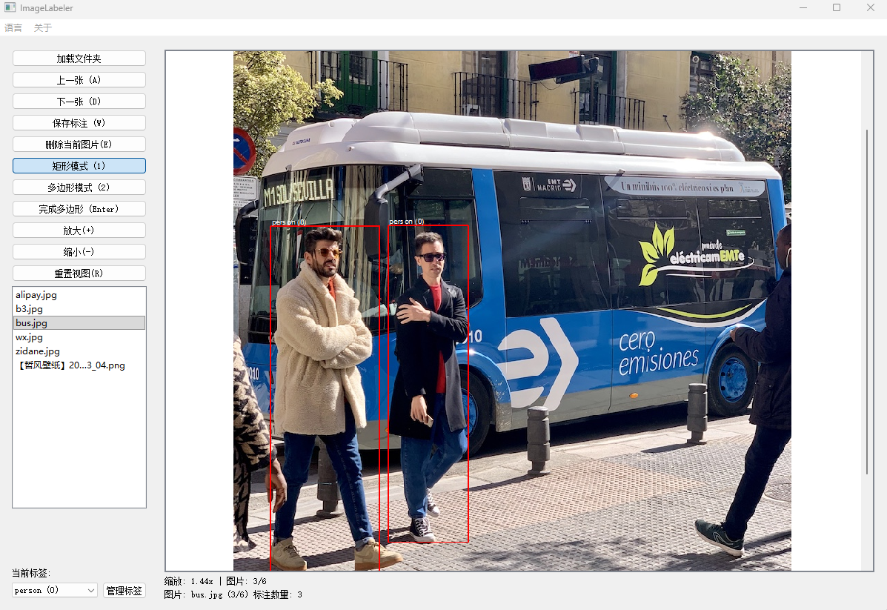

# ImageLabeler - 图片标注工具



一个轻量级、易用的图片数据标注工具，专为机器学习和计算机视觉项目设计。使用 C++ 和 Qt5 开发，支持跨平台运行。

## 📖 目录

- [功能特点](#-功能特点)
- [系统要求](#-系统要求)
- [安装与编译](#-安装与编译)
- [使用说明](#-使用说明)
- [快捷键](#-快捷键)
- [标注格式](#-标注格式)
- [技术架构](#-技术架构)
- [贡献](#-贡献)
- [许可证](#-许可证)

## ✨ 功能特点

### 核心功能
- 🖼️ **流畅的图像显示**：丝滑缩放图片不卡顿，流畅的操作体验
- 🏷️ **多种标注类型**：
  - 矩形框标注（支持 8 个控制点调整）
  - 多边形标注（支持任意顶点数）
- ↩️ **撤销/重做**：支持最多 100 步撤销回退操作
- 📁 **标签管理**：支持自定义标签类别，可添加、编辑、删除标签
- 🎯 **精准的标注工具**：
  - 支持移动和调整标注大小
  - 支持多边形顶点编辑
  - 选中高亮显示（黄色边框）
  - 不同类别使用不同颜色区分
- 📊 **批量处理**：文件夹加载，快速切换图片
- 🌐 **多语言支持**：中文/英文界面可切换

### 便捷操作
- 支持鼠标拖拽平移视图
- 滚轮缩放图片
- 右键菜单快速修改标签类别
- 图片列表快速导航
- 自动保存标注（切换图片或关闭程序时）

## 💻 系统要求

### 最低配置
- **操作系统**：Windows 7 / macOS 10.14 / Linux (Ubuntu 18.04+)
- **内存**：2 GB RAM
- **存储空间**：100 MB 可用空间
- **显示器分辨率**：1280x720

### 开发环境
- **编译器**：支持 C++20 的编译器（GCC 9+, Clang 10+, MSVC 2019+）
- **构建工具**：CMake 3.31+
- **Qt 版本**：Qt 5.14.2 或更高版本
- **依赖库**：Qt Core, Qt Gui, Qt Widgets, Qt Network, Qt SQL

## 📦 安装与编译

### Windows (MinGW)

```bash
# 克隆项目
git clone https://github.com/fgsqme/ImageLabeler.git
cd ImageLabeler

# 创建构建目录
mkdir build && cd build

# 配置项目（根据实际 Qt 路径修改 CMAKE_PREFIX_PATH）
cmake -G "MinGW Makefiles" \
      -DCMAKE_PREFIX_PATH="C:/Qt5.14.2/5.14.2/mingw73_64" \
      -DCMAKE_BUILD_TYPE=Release \
      ..

# 编译
cmake --build . --config Release

# 运行
class ImageLabeler.exe
```

### Linux

```bash
# 安装依赖
sudo apt-get install qtbase5-dev qttools5-dev cmake g++

# 克隆项目
git clone https://github.com/fgsqme/ImageLabeler.git
cd ImageLabeler

# 创建构建目录
mkdir build && cd build

# 配置项目
cmake -DCMAKE_BUILD_TYPE=Release ..

# 编译
make -j$(nproc)

# 运行
./ImageLabeler
```

### macOS

```bash
# 使用 Homebrew 安装依赖
brew install qt@5 cmake

# 克隆项目
git clone https://github.com/fgsqme/ImageLabeler.git
cd ImageLabeler

# 创建构建目录
mkdir build && cd build

# 配置项目
cmake -DCMAKE_PREFIX_PATH=/usr/local/opt/qt@5 \
      -DCMAKE_BUILD_TYPE=Release \
      ..

# 编译
make -j$(sysctl -n hw.ncpu)

# 运行
open ImageLabeler.app
```

### 静态编译（可选）

如需生成独立可执行文件（无需安装 Qt 运行时）：

```bash
cmake -DSTATIC_QT=ON -DCMAKE_BUILD_TYPE=Release ..
make -j$(nproc)
```

## 🚀 使用说明

### 快速开始

1. **启动程序**
   ```bash
   ./ImageLabeler  # Linux/macOS
   ImageLabeler.exe  # Windows
   ```

2. **加载图片文件夹**
   - 点击「加载文件夹」按钮
   - 选择包含待标注图片的文件夹
   - 支持的图片格式：PNG, JPG, JPEG, BMP, TIFF

3. **配置标签类别**
   - 点击「管理标签」按钮
   - 添加、编辑或删除标签类别
   - 标签将保存到 `classes.txt` 文件

4. **开始标注**
   - 选择绘制模式（矩形/多边形）
   - 在图片上绘制标注
   - 使用下拉框选择标注类别

5. **保存标注**
   - 按 `W` 键或点击「保存标注」按钮
   - 标注自动保存为 YOLO 格式的 `.txt` 文件

### 标注模式详解

#### 矩形标注模式
1. 选择「矩形模式」（或按 `1` 键）
2. 在图片上按住左键拖动绘制矩形
3. 松开鼠标完成绘制
4. 选中矩形后可通过 8 个控制点调整大小
5. 拖动矩形内部可移动位置

#### 多边形标注模式
1. 选择「多边形模式」（或按 `2` 键）
2. 依次点击多边形的各个顶点
3. 按 `Enter` 键或点击「完成多边形」按钮闭合多边形
4. 或点击右键快速完成绘制
5. 选中后可拖动顶点进行精细调整

### 标签管理

- **添加标签**：在标签管理对话框输入名称，点击「添加」
- **编辑标签**：选中已有标签，修改名称后点击「编辑」
- **删除标签**：选中要删除的标签，点击「删除」
- **标签存储**：标签配置保存在 `classes.txt` 文件中

### 图片管理

- **浏览图片**：使用图片列表快速切换
- **上一张/下一张**：使用按钮或快捷键 `A`/`D`
- **删除图片**：按 `E` 键删除并备份到 `bak` 文件夹

## ⌨️ 快捷键

### 导航控制
| 快捷键 | 功能 |
|--------|------|
| `A` | 上一张图片 |
| `D` | 下一张图片 |
| `R` | 重置视图（适应窗口） |
| `+` | 放大图片 |
| `-` | 缩小图片 |

### 标注操作
| 快捷键 | 功能 |
|--------|------|
| `1` | 切换到矩形模式 |
| `2` | 切换到多边形模式 |
| `Enter` | 完成多边形绘制 |
| `W` | 保存当前标注 |
| `Ctrl+Z` | 撤销操作 |
| `Ctrl+Shift+Z` | 重做操作 |
| `Delete` | 删除选中的标注 |
| `E` | 删除当前图片（带备份） |

### 视图控制
- **平移视图**：右键拖拽
- **缩放图片**：鼠标滚轮
- **选择标注**：左键点击标注框
- **移动标注**：选中后拖拽
- **调整标注**：选中后拖拽控制点

## 📝 标注格式

### 文件格式
标注文件以 `.txt` 格式保存，与图片文件同名。

例如：
- `image001.jpg` → `image001.txt`
- `test_photo.png` → `test_photo.txt`

### YOLO 格式规范

#### 矩形标注
```
<class_id> <x_center> <y_center> <width> <height>
```

参数说明：
- `<class_id>`: 类别索引（从 0 开始）
- `<x_center>`: 矩形中心点 X 坐标（归一化，0-1 之间）
- `<y_center>`: 矩形中心点 Y 坐标（归一化，0-1 之间）
- `<width>`: 矩形宽度（归一化，0-1 之间）
- `<height>`: 矩形高度（归一化，0-1 之间）

示例：
```
0 0.45 0.65 0.20 0.30
1 0.75 0.35 0.15 0.25
```

#### 多边形标注
```
<class_id> <x1> <y1> <x2> <y2> ... <xn> <yn>
```

参数说明：
- `<class_id>`: 类别索引（从 0 开始）
- `<x1>, <y1>`: 第 1 个顶点坐标（归一化）
- `<x2>, <y2>`: 第 2 个顶点坐标（归一化）
- ...以此类推

示例（三角形）：
```
2 0.10 0.10 0.90 0.10 0.50 0.90
```

### 归一化坐标
所有坐标均为相对于图片宽度和高度的归一化值：
- `归一化 X = 像素 X / 图片宽度`
- `归一化 Y = 像素 Y / 图片高度`

此格式与 YOLO、Darknet 等主流目标检测框架完全兼容。

## 🏗️ 技术架构

### 项目结构
```
ImageLabeler/
├── main.cpp                      # 程序入口
├── mainwindow.h/.cpp             # 主窗口类
├── annotationgraphicsview.h/.cpp # 标注图形视图（核心）
├── classmanagerdialog.h/.cpp     # 标签管理对话框
├── translations/                 # 翻译文件
│   ├── label_en.ts              # 英文翻译
│   └── label_zh.ts              # 中文翻译
├── translations.qrc              # Qt 资源文件
├── CMakeLists.txt                # CMake 配置文件
└── README.md                     # 项目文档
```

### 核心组件

#### MainWindow（主窗口）
- 负责整体 UI 布局
- 菜单栏和工具栏管理
- 图片文件管理
- 快捷键绑定
- 多语言切换

#### AnnotationGraphicsView（标注视图）
- 基于 QGraphicsView 的自定义图形视图
- 实现矩形和多边形绘制
- 支持缩放、平移、旋转等变换
- 处理鼠标和键盘事件
- 管理标注数据的撤销/重做栈

#### ClassManagerDialog（标签管理）
- 标签类别的增删改查
- 与 `classes.txt` 文件交互
- 提供标签配置界面

### 数据流

```
用户操作 → MainWindow → AnnotationGraphicsView → 标注数据
                              ↓
                        保存为 YOLO 格式 .txt 文件
```

### 设计模式
- **MVC 模式**：数据（标注）与视图（GraphicsView）分离
- **命令模式**：撤销/重做功能
- **观察者模式**：信号槽机制（Qt Signal/Slot）

## 🤝 贡献

欢迎提交 Issue 和 Pull Request！

### 开发计划
- [ ] 支持更多标注形状（圆形、椭圆、线段）
- [ ] 导出 COCO、VOC 等格式
- [ ] 自动标注辅助功能
- [ ] 标注统计和分析
- [ ] 深色主题支持

### 问题反馈
如遇到问题，请在 GitHub 仓库提交 Issue，并提供：
- 操作系统版本
- Qt 版本
- 复现步骤
- 错误截图（如有）

## 📄 许可证

本项目采用 MIT 许可证。详见 LICENSE 文件。

## 🙏 致谢

- 感谢使用 Qt 框架（https://www.qt.io/）
- 感谢所有贡献者和用户反馈

## 📧 联系方式

- **作者**：fgsqme
- **GitHub**：https://github.com/fgsqme/ImageLabeler
- **邮箱**：请通过 GitHub Issues 联系

---

**享受标注！** 🎉

