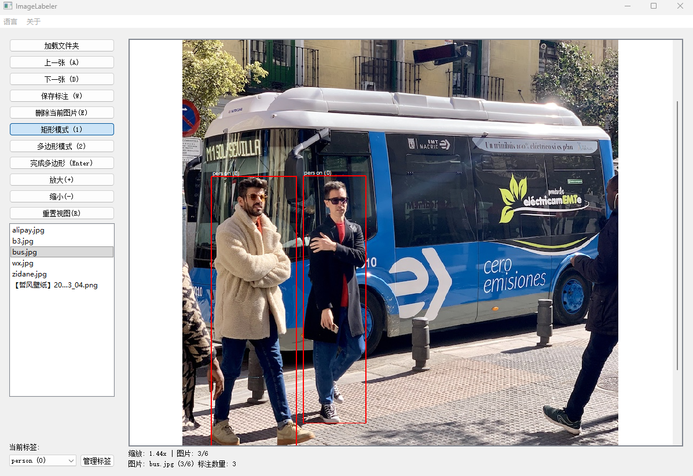

# ImageLabeler - 图片标注工具

一个轻量级、易用的图片数据标注工具，专为机器学习和计算机视觉项目设计。

## 功能特点

- 🖼️ 丝滑缩放图片不卡顿，流畅的操作体验
- 🏷️ 多种标注类型：矩形框、多边形
- ↩️ 支持撤销回退操作
- 📁 支持标签管理，自定义标签
- 🎯 精准的标注工具和便捷的操作界面
- 📊 批量处理功能，提高标注效率

## 使用说明

1. 选择需要标注土拍图片的文件夹
2. 选择需要标注的图片
3. 使用工具栏选择标注类型，默认矩形标注
4. 在图片上进行标注操作
5. 保存标注结果

